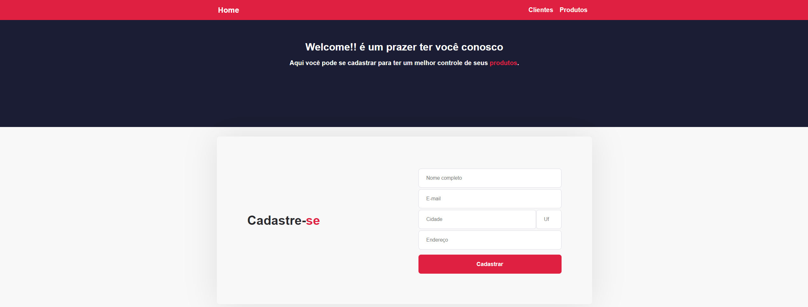

  <a href="#-tecnologias">Tecnologias</a>&nbsp;&nbsp;&nbsp;|&nbsp;&nbsp;&nbsp;
  <a href="#-projeto">Projeto</a>

 

 

  

 

  Projeto desenvolvido para o Desafio #2 do programa de capacitação da Hiring Coders juntamente com a Gama Academy

 

## 🚀 Tecnologias

Esse projeto foi desenvolvido com as seguintes tecnologias:

- HTML
- CSS
- JavaScript
- React JS

## 💻 Sobre o Projeto
### Desafio #2: Ecommerce

-Desafio - Criar um sistema de e-commerce onde os dados dos crientes cadastrados e s dados de seus produtos seram salvos no localstorage.

- >Os dados de clientes, endereços e produtos devem estar devidamente estruturados
- >Dados no localstorage
- >Código fonte no github com o arquivo README detalhando as funcionalidades da programação

